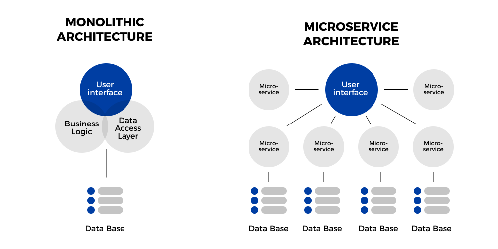

# Docker
## What is Docker?
Docker is an open source containerization platform. It enables developers to package applications into containers—standardized executable components combining application source code with the operating system (OS) libraries and dependencies required to run that code in any environment.

Docker uses virtual machines (VMs) within its containers. This means that it can be used to run VMs that you need in order to develop, build or test things on your local machine. Docker works by sharing resources between your localhost and its VM's in a much more efficient way than VirtualBox. Therefore, Docker is more lightweight and much faster than using VirtualBox or Vagrant to set up VMs.

## What are microservices?
Microservices are a cloud native archtectural approach in which a single application is composed of many loosely coupled and independently deployable smaller components, or services. The advantages of a microservices archtecture are:
- Code can be updated more easily.
- Different teams can use different tools, technologies or programming languages for different components of the system.
- Individual components can be scaled independently of one another, reducing the amount of time and resources that are wasted in scaling up an entire application because a single feature is experiencing too much load.

The most important benefit that a microservices architecture provides is that it allows organisations and groups of teams to operate in a manner that is __*more agile*__.

## Microservices vs Monolithic
### Monolithic architecture
We have previously created a web app and database using monolithic architecure. The advantages of using monolithic architecture are:
- **Simple and easy** - in all aspects.
    - Creation and building
    - Testing
    - Deployment

However, the disadvantages of monolithic architecure:
- Large (possible complicated) code base
- Size of the application can significantly affect startup time
- Each element is dependent on another - difficult to change/update things post-deployment

### Microservices architecture
The advantages of independent components, increased scalability and agile workflow that come with a microservices architecture have already been highlighted. The disadavantages of such architecture are:

- Extra complexity - The architecture is a distributed system of containers that must be able to communicate with each other.
- Testing - Much harder to test many independent deployable components.
- Cost - For microservices architecure, sufficient hosting infrastructure is required, with skilled teams that have the skills to understand and manage the services.

